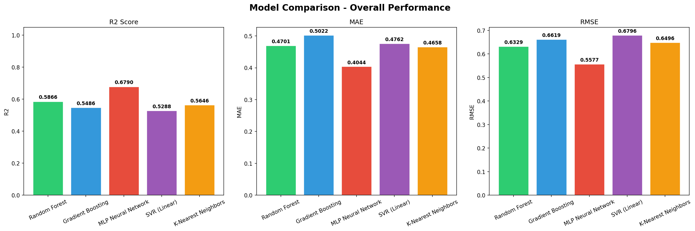
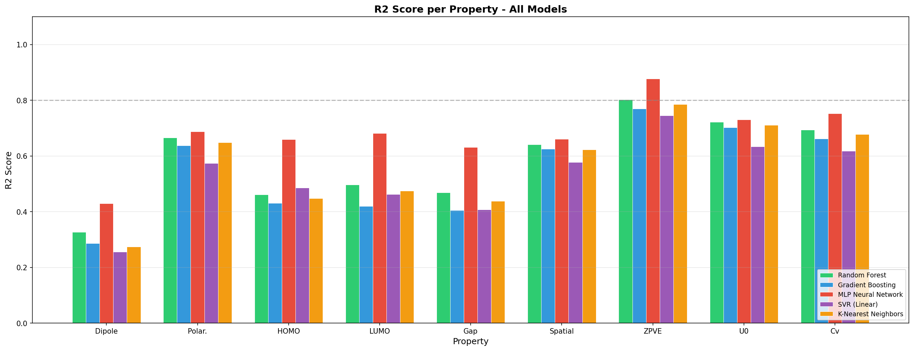
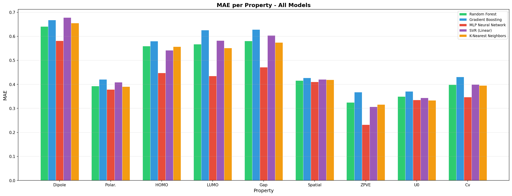
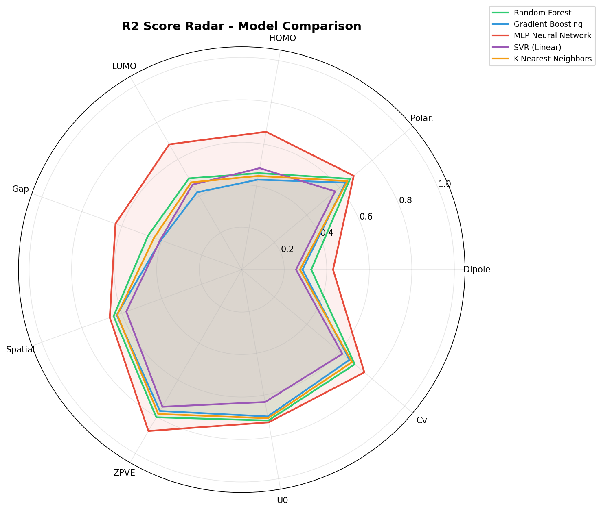
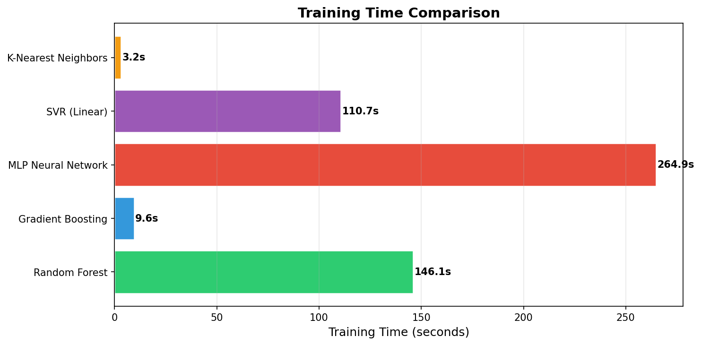
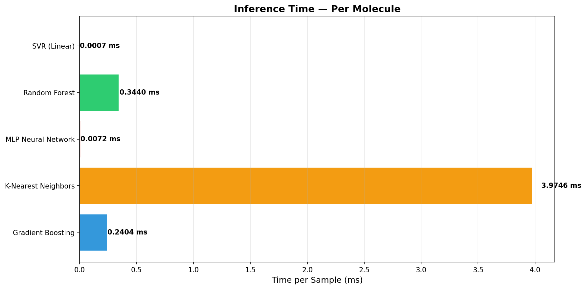
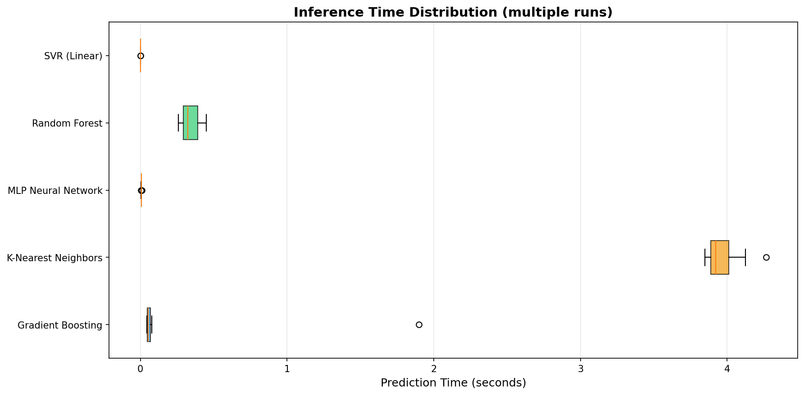

# Intelligent Molecular Prediction for Drug R&D Cost Reduction

A machine learning pipeline for predicting quantum-mechanical molecular properties from SMILES representations. The system combines Graph Neural Network (GNN) embeddings with classical ML regressors to deliver fast and accurate property predictions, served through a REST API with an interactive web interface.

---

## Table of Contents

1. [Project Overview](#project-overview)
2. [Architecture](#architecture)
3. [Predicted Properties](#predicted-properties)
4. [Model Comparison Results](#model-comparison-results)
5. [Inference Benchmark](#inference-benchmark)
6. [Repository Structure](#repository-structure)
7. [Prerequisites](#prerequisites)
8. [Installation](#installation)
9. [Usage Guide](#usage-guide)
10. [API Reference](#api-reference)

---

## Project Overview

This project addresses the high computational cost of quantum-mechanical simulations (such as Density Functional Theory) in pharmaceutical research. Rather than running expensive ab initio calculations for every candidate molecule, the pipeline learns to predict key molecular properties directly from a molecule's SMILES string in milliseconds.

The pipeline follows a two-stage approach:

1. **Stage 1 -- GNN Embedding Extraction:** A three-layer Graph Convolutional Network converts molecular graphs into compact 32-dimensional embedding vectors, capturing structural and electronic information.
2. **Stage 2 -- Property Prediction:** Trained ML regressors (Random Forest, Gradient Boosting, MLP, SVR, KNN) map these embeddings to nine quantum-mechanical target properties.

The system is trained on the QM9 dataset, which contains approximately 134,000 small organic molecules with DFT-computed properties.

---

## Architecture


---

## Predicted Properties

| Property             | Unit       | Description                                   |
|----------------------|------------|-----------------------------------------------|
| Dipole Moment        | Debye      | Electric dipole moment                        |
| Polarizability       | Bohr^3     | Isotropic polarizability                      |
| HOMO Energy          | Hartree    | Highest occupied molecular orbital energy     |
| LUMO Energy          | Hartree    | Lowest unoccupied molecular orbital energy    |
| HOMO-LUMO Gap        | Hartree    | Energy gap between HOMO and LUMO              |
| Spatial Extent       | Bohr^2     | Electronic spatial extent                     |
| Zero-Point Energy    | Hartree    | Zero-point vibrational energy                 |
| Internal Energy (0K) | Hartree    | Internal energy at 0 Kelvin                   |
| Heat Capacity        | cal/mol*K  | Heat capacity at 298.15 Kelvin                |

---

## Model Comparison Results

Five regression models were trained and evaluated on 20% held-out test data. The following table summarizes overall performance:

| Model               | R2     | MAE    | RMSE   | Training Time (s) |
|----------------------|--------|--------|--------|--------------------|
| MLP Neural Network   | 0.6790 | 0.4044 | 0.5577 | 264.9              |
| Random Forest        | 0.5866 | 0.4701 | 0.6329 | 146.1              |
| K-Nearest Neighbors  | 0.5646 | 0.4658 | 0.6496 | 3.2                |
| Gradient Boosting    | 0.5486 | 0.5022 | 0.6619 | 9.6                |
| SVR (Linear)         | 0.5288 | 0.4762 | 0.6796 | 110.7              |

The MLP Neural Network achieved the highest R2 score (0.6790) and lowest MAE (0.4044), making it the best-performing model overall.

### Overall Performance Comparison



### R2 Score per Property



### MAE per Property



### Radar Chart -- R2 Across All Properties



### Training Time Comparison



---

## Inference Benchmark

Inference speed was benchmarked on 1,000 test samples over 10 repeated runs:

| Model               | Mean Time (s) | Per Sample (ms) |
|----------------------|---------------|-----------------|
| SVR (Linear)         | 0.000736      | 0.000736        |
| MLP Neural Network   | 0.007179      | 0.007179        |
| Gradient Boosting    | 0.240361      | 0.240361        |
| Random Forest        | 0.343970      | 0.343970        |
| K-Nearest Neighbors  | 3.974553      | 3.974553        |

SVR (Linear) is the fastest model, while MLP Neural Network offers the best balance between accuracy and speed.

### Inference Time -- Per Molecule



### Inference Time Distribution



---

## Repository Structure

```
Project/
|-- data_extracting_qm9.ipynb        # Data extraction from QM9 dataset
|-- Preprocessing.ipynb              # Data cleaning and preprocessing
|-- generate_embeddings.py           # GNN training and embedding extraction
|-- model_comparison.py              # Model training, evaluation, and plotting
|-- model_inference_benchmark.py     # Inference speed benchmarking
|-- predict_molecule.py              # Command-line prediction tool
|-- api_server.py                    # Flask REST API with web interface
|-- gnn_embedding_model.pt           # Trained GNN weights
|-- saved_models/                    # Trained ML model files (.joblib)
|-- plots/                           # Generated evaluation plots
|-- model_comparison_results.csv     # Summary metrics for all models
|-- model_comparison_detail.csv      # Per-property metrics for all models
|-- inference_benchmark_results.csv  # Inference timing results
`-- .gitignore
```

---

## Prerequisites

- Python 3.9 or later
- CUDA-capable GPU (optional, CPU is sufficient)

### Required Libraries

| Package           | Purpose                          |
|-------------------|----------------------------------|
| torch             | PyTorch deep learning framework  |
| torch-geometric   | Graph neural network layers      |
| rdkit             | Molecular parsing and features   |
| scikit-learn      | ML models and preprocessing      |
| pandas            | Data manipulation                |
| numpy             | Numerical computing              |
| matplotlib        | Visualization                    |
| joblib            | Model serialization              |
| flask             | REST API server                  |
| flask-cors        | Cross-origin request support     |
| tqdm              | Progress bars                    |

---

## Installation

```bash
# 1. Clone the repository
git clone https://github.com/RaneemSadeh/Intelligent-Molecular-Prediction-for-Drug-R-D-Cost-Reduction.git
cd Intelligent-Molecular-Prediction-for-Drug-R-D-Cost-Reduction

# 2. Create and activate a virtual environment
python -m venv venv
venv\Scripts\activate        # Windows
# source venv/bin/activate   # macOS / Linux

# 3. Install PyTorch (adjust for your CUDA version; CPU example shown)
pip install torch torchvision torchaudio --index-url https://download.pytorch.org/whl/cpu

# 4. Install PyTorch Geometric
pip install torch-geometric

# 5. Install remaining dependencies
pip install rdkit scikit-learn pandas numpy matplotlib flask flask-cors tqdm joblib
```

---

## Usage Guide

The pipeline is designed to be executed in sequential stages. If pre-trained model files are already present in the repository, Steps 1 through 3 can be skipped.

### Step 1: Data Extraction

Open and run `data_extracting_qm9.ipynb` in Jupyter Notebook. This downloads and extracts the QM9 dataset, producing `molecule_data.csv`.

### Step 2: Generate GNN Embeddings

```bash
python generate_embeddings.py
```

This trains the GNN on the molecular graph data and appends 32-dimensional embedding vectors to each molecule, producing `molecule_data_with_embeddings.csv` and saving the model weights to `gnn_embedding_model.pt`.

### Step 3: Preprocessing

Open and run `Preprocessing.ipynb` to apply feature engineering and PCA reduction, producing `molecule_data_preprocessed.csv`.

### Step 4: Train and Compare Models

```bash
# Full dataset (recommended)
python model_comparison.py

# Quick test with a subset
python model_comparison.py --sample 10000
```

This trains all five models, saves them to `saved_models/`, generates evaluation plots in `plots/`, and writes results to CSV files.

### Step 5: Inference Benchmark (Optional)

```bash
python model_inference_benchmark.py
python model_inference_benchmark.py --sample 1000 --runs 10
```

### Step 6: Single Molecule Prediction (CLI)

```bash
# Predict a specific molecule
python predict_molecule.py --smiles "CCO"

# Interactive mode
python predict_molecule.py

# Retrain the predictor
python predict_molecule.py --train
```

### Step 7: Start the API Server

```bash
# Default: first available model on port 5000
python api_server.py

# Specify model and port
python api_server.py --model mlp_neural_network --port 8080

# List available models
python api_server.py --list
```

Once running, open `http://localhost:5000` in a browser to access the interactive prediction interface.

---

## API Reference

| Method | Endpoint             | Description                         |
|--------|----------------------|-------------------------------------|
| POST   | `/api/predict`       | Predict properties for one molecule |
| POST   | `/api/predict/batch` | Batch prediction (up to 100)        |
| POST   | `/api/embedding`     | Retrieve the GNN embedding vector   |
| GET    | `/api/models`        | List available models               |
| GET    | `/api/properties`    | Property definitions and units      |
| GET    | `/api/health`        | Health check                        |

### Example Request

```bash
curl -X POST http://localhost:5000/api/predict \
  -H "Content-Type: application/json" \
  -d '{"smiles": "CCO"}'
```

### Example Response

```json
{
  "molecule": {
    "smiles": "CCO",
    "formula": "C2H6O",
    "num_atoms": 3,
    "num_heavy_atoms": 3,
    "num_bonds": 2
  },
  "properties": [
    {"name": "dipole_moment", "value": 1.567, "unit": "Debye"},
    {"name": "homo_energy", "value": -0.3521, "unit": "Hartree"}
  ],
  "inference_time_ms": 12.34,
  "model_used": "MLP Neural Network"
}
```

---

## License
Capstone Project at Al-Hussein Bin Abdullah II Technical University.
